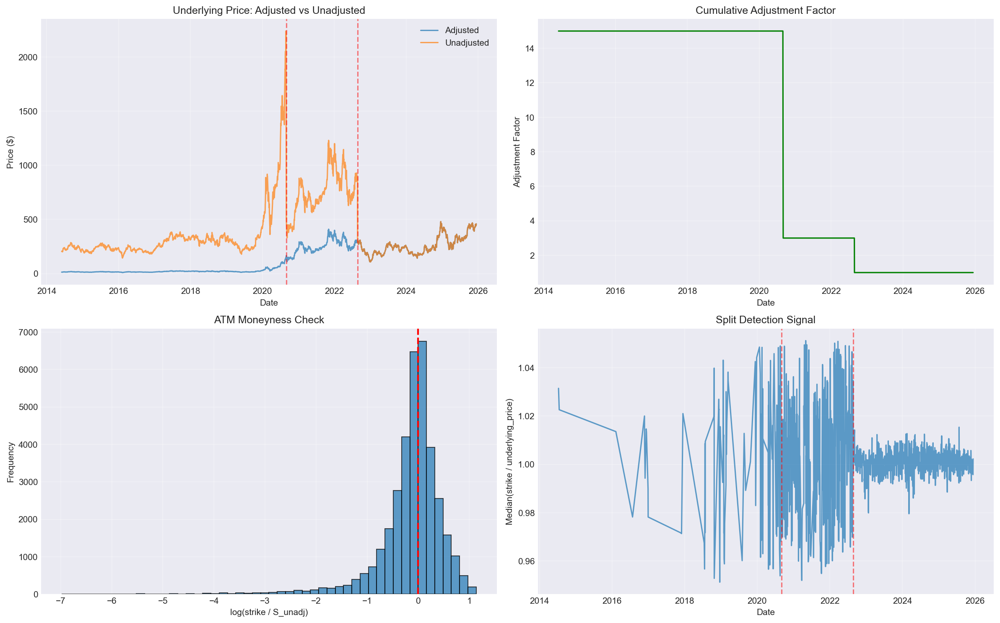
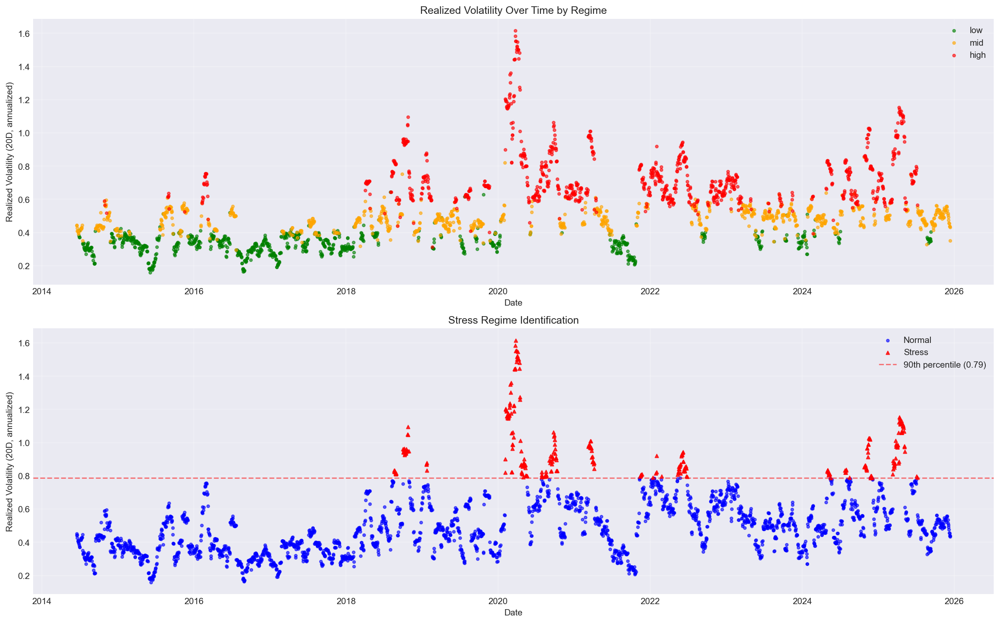
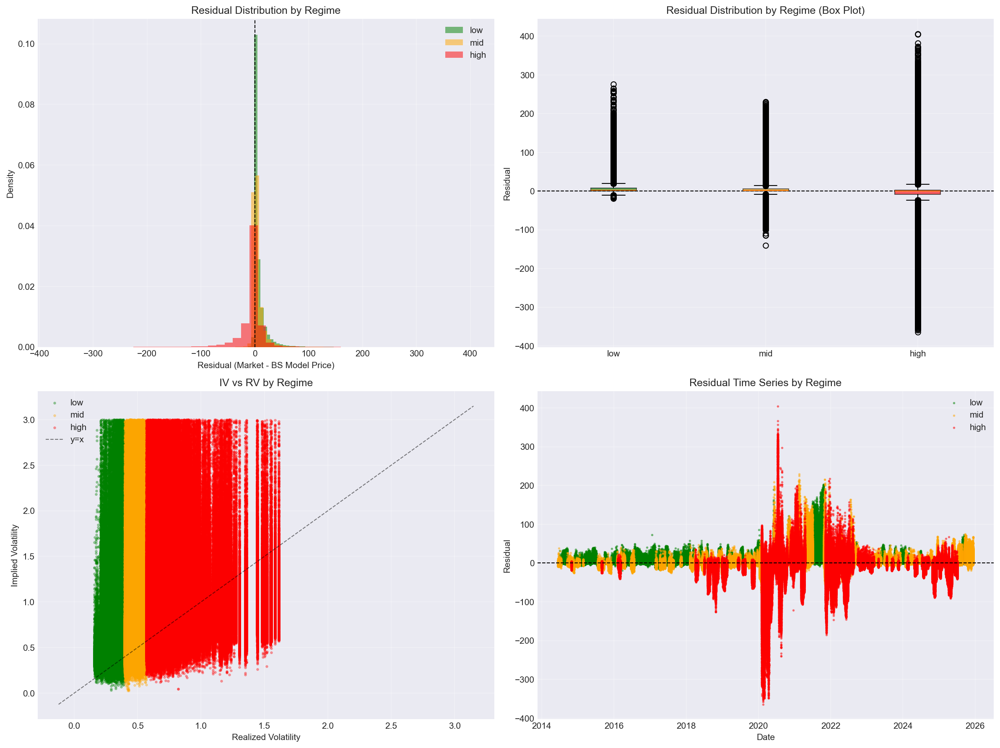
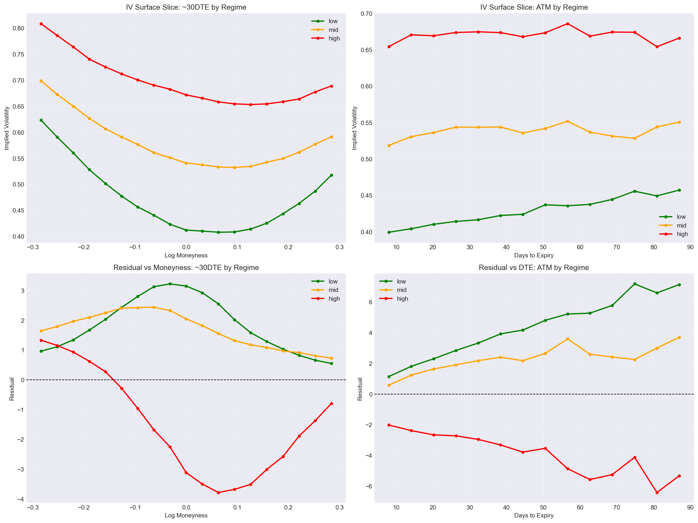
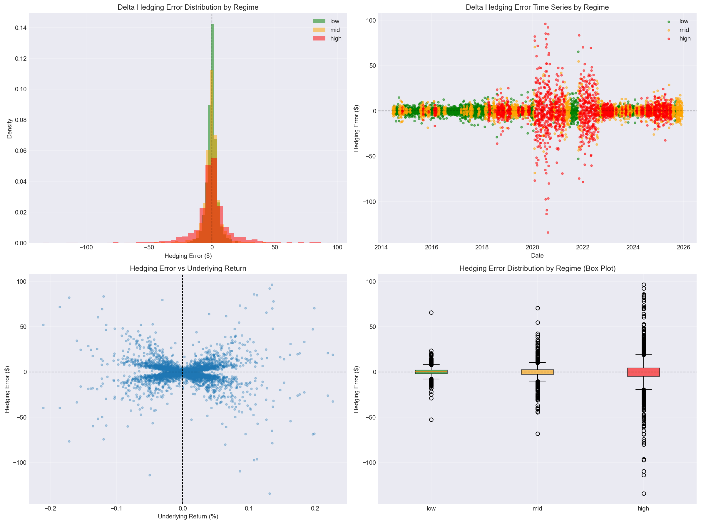

# Black–Scholes Under Volatility Regime Instability (TSLA Options Surface, 2014–2025)

This study is a **diagnostic research note**: it evaluates when the Black–Scholes model behaves like a reliable *local approximation* and when it breaks down under **volatility regime instability**.

The objective is not to "prove BS wrong," nor to propose an alpha strategy. The objective is to show **regime-conditioned pricing and hedging failure modes** with clean data construction and causal hygiene.

---

## Research Question

**Primary question**

> Under what volatility regimes does Black–Scholes cease to be a reliable local approximation for pricing and delta hedging equity options?

Regime instability matters in practice because option pricing and risk management decisions depend on model reliability. When volatility regimes shift, pricing models that assume constant volatility can systematically misprice options, leading to valuation errors. Similarly, delta-hedging strategies calibrated under stable regimes may fail to protect portfolios during volatility spikes, exposing traders to unhedged risk.

**Sub-questions**

1. **Data integrity:** Can we align underlying prices to the same scale as option strikes (split-consistent unadjustment)?
2. **Regime definition:** Do trailing realized-volatility regimes (low/mid/high) meaningfully partition the sample without lookahead?
3. **IV vs RV stability:** Does the IV–RV relationship become noisier or biased in higher-volatility regimes?
4. **Pricing residuals:** Do Black–Scholes pricing residuals (market − model) widen and/or shift by regime under a stable volatility proxy?
5. **Surface behavior:** How do the implied-volatility smile and term structure change by regime?
6. **Hedging reliability:** Does one-day delta-hedging error become heavier-tailed in high-volatility regimes?

---

## Data

- **Underlying:** TSLA
- **Sample:** ~11 years of option surface observations (daily option quotes, 2014-06-02 to 2025-12-12)
- **Total observations:** 5,180,981 option-day records (after cleaning)
- **Required fields:** `date`, `expiry`, `cp` (call/put), `strike`, `close` (option price), `underlying_price`
- **Data source:** `./../../../data/raw/tsla_options_with_underlying.csv`
- **Important:** Option strikes are quoted on an **unadjusted** share-price basis, so the study reconstructs a split-consistent unadjusted underlying series (`S_unadj`) before computing moneyness, RV, or any BS quantities.

---

## Methods

### 1) Split-consistent underlying reconstruction (`S_unadj`)
Corporate actions can induce spurious discontinuities if price series are mixed across adjusted/unadjusted scales. If realized volatility were computed on adjusted prices while option strikes remain unadjusted, it would lead to inconsistencies between strikes, implied volatility, and option prices. Corporate actions make the stock look like it jumped when in reality it did not, which creates fake realized volatility that contaminates regime classification and pricing diagnostics.

- Known splits (TSLA): 2020-08-31 (5-for-1), 2022-08-25 (3-for-1)
- Construct a **cumulative adjustment factor** and define:
  - `S_unadj = underlying_price_adj * adjustment_factor`
- Recompute:
  - `log_moneyness = log(strike / S_unadj)`

**Validation**
- ATM log-moneyness distribution is checked to be centered near 0.
- Plots produced:
  - `unadjustment_validation.png`



---

### 2) Realized volatility (RV) and regime labeling (causal)
Realized volatility is computed on the **unadjusted** series to match the strike scale. This ensures consistency: if RV were computed on adjusted prices, it would create artificial volatility spikes at split dates, leading to misclassification of regimes and invalidating the causal structure of the analysis.

- Compute log returns on `S_unadj`
- Split-guard returns:
  - exclude split date ±1 trading day
  - exclude irregular gaps (e.g., previous date gap > 3 calendar days)
  - optional robust clipping for extreme returns (abs(ret) > 0.5)
- RV definition:
  - `RV_20 = rolling_std(log_return, 20, min_periods=10) * sqrt(252)`

**Causal alignment**
- Regimes are defined using **lagged** RV:
  - `RV_20_lag1 = RV_20.shift(1)`
- This lagging is necessary to ensure causal validity: at time t, we are guaranteed to have information from t−1, but not necessarily from t. Using contemporaneous RV would introduce lookahead bias, making regime classification predictive rather than diagnostic.
- Regime thresholds:
  - low / mid / high based on 33% and 67% quantiles of `RV_20_lag1`
  - stress regime if `RV_20_lag1` > 90th percentile

**Quantiles observed:**
- 33rd percentile: 0.3980
- 67th percentile: 0.5695
- 90th percentile: 0.7864

Plot produced:
- `rv_regimes.png`



---

### 3) Black–Scholes quantities
- Risk-free rate: constant `r = 0.04`
- Dividend yield: `q = 0.0`
- Implied volatility:
  - solved via robust bisection per option observation
  - cached to parquet (`./_cache/iv_cache_*.parquet`) to avoid recomputation
  - valid IV rate: 95.3% (4,936,396 / 5,180,981)
  - IV range: [0.0258, 4.9996], mean: 0.7512, median: 0.6373
- Greeks:
  - delta, gamma computed using BS formulas (vectorized)

---

### 4) Pricing residual diagnostics under a stable volatility proxy
To avoid tautology (pricing with market IV), pricing diagnostics use a **sigma proxy**. Implied volatility already reflects what the market thinks volatility will be, which overfits Black–Scholes to the market and obscures model failures. By using an independent volatility proxy (realized volatility or smoothed ATM IV), we can assess whether BS pricing errors are regime-dependent when the model is not "cheating" with market-implied parameters.

Sigma proxy options:
- Primary: trailing realized volatility `RV_20_lag1`
- Secondary: cross-sectional ATM IV (~30DTE) smoothed without lookahead (5-day rolling median, shifted by 1 day)
- Final proxy: `sigma_proxy = sigma_proxy_RV.fillna(sigma_proxy_IV)`

Model price:
- `C_BS_proxy = BS(S_unadj, K, T, r, q, sigma_proxy)`

Residuals:
- `residual_proxy = market_close - C_BS_proxy`
- `residual_proxy_pct = residual_proxy / market_close`

Key plots:
- residual distributions by regime
- residual time series by regime
- IV vs RV by regime
Saved as:
- `diagnostic_plots.png`



---

### 5) Surface slices by regime
To study regime-conditioned smile/term structure behavior:

- Smile slice: IV vs log-moneyness around ~30DTE (±7 days)
- Term structure: ATM IV vs DTE (5–90D)
- Residual vs moneyness and DTE by regime

Saved as:
- `iv_surface_analysis.png`



---

### 6) One-day delta-hedging diagnostic
A canonical contract is selected each day:
- ~30DTE (±7 days) and closest-to-ATM (min |log moneyness|)
- Separate selection for calls and puts
- Hedging performed over t → t+1 if the same contract exists next day

Hedge P&L:
- option P&L: `ΔV = V_{t+1} − V_t`
- hedge P&L: `−Δ_t (S_{t+1} − S_t)`
- total P&L: `ΔV + hedge_PnL`

Define hedging error vs BS prediction (using same-day IV to compute BS value at t+1):
- `hedging_error = total_pnl − bs_pnl`

**Sample size:** 5,806 canonical option-day observations, resulting in 5,681 hedging periods (calls and puts processed separately)

Saved as:
- `delta_hedging_analysis.png`



---

## Results (Regime-Conditioned Summary)

### Pricing residuals by regime (sigma proxy pricing)
Residuals are strongly regime-dependent and become materially heavier-tailed in high volatility.

**Summary statistics**

```
Regime  N_Observations  Mean_IV  Median_IV  Mean_RV  Mean_Residual  Median_Residual  RMSE_Residual  MAE_Residual  Std_Residual
low          942171    0.5794     0.5115    0.3286       7.4297         2.6325        16.0028       7.5888      14.1736
mid         1702945    0.6886     0.6016    0.4888       5.0789         1.6184        12.4309       5.8540      11.3460
high        2253859    0.8288     0.7149    0.7648      -5.5631        -0.1331        28.1921      13.1302      27.6377
```

**Interpretation**
- Low/mid regimes show positive residuals on average (BS proxy underprices). This suggests that in stable markets, option prices embed modest risk premia beyond what realized volatility alone would justify, reflecting normal insurance demand.
- High regime shows negative mean residual and much larger error dispersion. The sign reversal indicates that during volatility spikes, market prices often exceed BS model prices even when using elevated realized volatility as the proxy. This reflects fear-driven demand for protection (volatility risk premium) and the market's anticipation of continued volatility clustering that the constant-volatility BS model cannot capture.
- RMSE and residual standard deviation increase sharply in high regimes, consistent with model instability under volatility clustering and regime shifts. The heavy-tailed error distribution in high regimes suggests that BS pricing failures are not merely mean shifts but fundamental distributional breakdowns.

---

### Delta hedging error by regime
Hedging error variance grows strongly with regime severity.

**Summary statistics**

```
Regime  N_Periods  Mean_Hedging_Error  Median_Hedging_Error  RMSE_Hedging_Error  MAE_Hedging_Error  Std_Hedging_Error
low       1853           -0.0135              0.0488            4.8055            3.0414             4.8068
mid       1926           -0.0941             -0.0172            7.4780            4.4125             7.4793
high      1902           -0.2714             -0.2265           16.6264            9.6103            16.6286
```

**Interpretation**
- Delta hedging error is near-zero on average but becomes substantially more dispersed in high regimes. The near-zero mean across all regimes suggests that delta hedging is directionally correct on average, but the variance explosion in high regimes reveals that discrete rebalancing and volatility jumps create large tail risks.
- RMSE increases from ~4.8 (low) → ~7.5 (mid) → ~16.6 (high), indicating heavy-tailed hedging losses during stress regimes. This threefold increase in hedging error dispersion reflects the breakdown of the continuous-hedging assumption: during volatility spikes, price moves occur faster than daily rebalancing can capture, and the constant-volatility assumption fails to predict the magnitude of moves.

---

## Discussion

### What "regime instability" means here
Regime instability is the empirical observation that **pricing and hedging errors are not stationary**. They change in **level and distribution shape** as the market transitions from low → mid → high realized volatility regimes. This study is diagnostic, not predictive or alpha-seeking: it identifies conditional failure modes rather than proposing trading strategies.

### Why the failures occur
Black–Scholes assumes:
- constant volatility
- continuous hedging / continuous-time diffusion dynamics
- stable distributional structure

High-volatility periods violate these assumptions most severely through:
- volatility clustering and volatility-of-volatility
- jump-like price moves
- discrete hedging effects
- changes in risk premia embedded in option prices

### Practical implication
Black–Scholes is a good guideline and mapping to the markets, but one must be cautious during high-volatility regimes. BS Greeks and constant-σ pricing are most reliable in stable regimes, where the model serves as a useful local approximation. During stress regimes, regime-aware risk controls and alternative dynamics (stochastic volatility / jumps) are justified. The failures documented here are conditional on regime, not universal: the model's utility depends on recognizing when its assumptions hold and when they break down.

---

## Limitations

1. Constant interest rate (`r = 0.04`) across the full sample.
2. No bid/ask modeling or microstructure noise handling.
3. Delta hedging is discrete (daily) and excludes transaction costs.
4. Single underlying (TSLA); results may differ across underlyings.
5. Residual diagnostics depend on sigma proxy choice (RV-based vs smoothed ATM IV).
6. Although split-safe RV is enforced, vendor data quality (stale quotes, odd prints) can still affect results.
7. IV computation uses bisection with fixed bounds (0.000001 to 5.0), which may miss extreme cases.

---

## Reproducibility

### Outputs
Figures (saved in project root):
- `unadjustment_validation.png` - Split adjustment validation and underlying price reconstruction
- `rv_regimes.png` - Realized volatility over time with regime classification
- `diagnostic_plots.png` - Pricing residuals, IV vs RV, and residual time series by regime
- `iv_surface_analysis.png` - IV smile and term structure slices by regime
- `delta_hedging_analysis.png` - Delta hedging error distributions and time series by regime

### Data Requirements
- Input CSV: `./../../../data/raw/tsla_options_with_underlying.csv`
- Required columns: `ticker`, `date`, `expiry`, `cp`, `strike`, `close`, `underlying_price`

### Caching
- Implied volatility is computed via bisection and cached to `./_cache/iv_cache_*.parquet` to avoid recomputation.
- Cache is keyed by MD5 hash of input data (prices, strikes, times, option types).

### Notes
- Regimes are computed using lagged RV with split-day and gap guards to prevent artificial RV spikes.
- The notebook processes ~5.2M option-day observations; IV computation takes ~2 minutes with caching.

---

## One-sentence takeaway

Black–Scholes behaves as a useful local approximation in low volatility regimes, but its pricing and delta-hedging reliability deteriorate sharply under volatility regime instability, with high regimes exhibiting heavy-tailed residual and hedging error distributions.

